# PubMiner - 基于大语言模型的模块化文献分析工具

[](https://www.python.org/downloads/)
[](LICENSE)
[]()

**PubMiner 仍在开发中，功能还不完善。**

> **🎯 最近更新**(2025-11-11): 
> - PDF 下载器性能优化
> - 冗余代码清理

PubMiner 是一个专门针对 PubMed 医学文献的智能分析工具，通过模块化架构实现文献检索、全文提取、结构化分析和批量处理，帮助研究人员高效挖掘文献信息。

## 🎯 核心特性

- **🔍 智能检索**：支持复杂 PubMed 查询语法，自动获取引用关系和被引次数
- **📄 多源提取**：集成 PMC 全文、 PDF 解析、 OCR 识别和 BioC API
- **📥 智能下载**：多源 PDF 下载（PMC + SciHub + EuropePMC），智能重试和容错机制
- **🧠 AI 分析**：支持 OpenAI、 DeepSeek、通义千问、火山引擎等多个 LLM 提供商
- **📊 结构化输出**：22 个标准字段 + 自定义字段，输出标准 CSV 格式
- **⚡ 高效处理**：并发处理、断点续传、智能重试机制
- **💰 成本优化**：文本压缩、批量处理，显著降低 API 调用成本
- **📋 批量任务**：JSON 配置驱动的自动化批量分析
- **🔧 模块化配置**：全新的配置架构，支持环境变量和多环境配置
- **🧪 全面测试**：4 个核心测试套件，涵盖端到端工作流

## 🏗️ 项目架构

```mermaid
graph TD
    A["（根） PubMiner"] --> B["core"];
    A --> C["utils"];
    A --> D["extractors"];
    A --> E["optimizers"];
    A --> F["examples"];
    A --> G["tests"];
    A --> H["config"];
    A --> I["results"];
    A --> J["ref_projects"];

    B --> B1["config_manager.py"];
    B --> B2["pubmed_fetcher.py"];
    B --> B3["text_extractor.py"];
    B --> B4["pdf_downloader.py"];
    B --> B5["llm_analyzer.py"];
    B --> B6["data_processor.py"];
    B --> B7["query_manager.py"];
    B --> B8["scihub_downloader.py"];

    C --> C1["logger.py"];
    C --> C2["api_manager.py"];
    C --> C3["file_handler.py"];
    C --> C4["rich_logger.py"];

    D --> D1["base_extractor.py"];
    D --> D2["standard_extractor.py"];
    D --> D3["custom_extractor.py"];

    E --> E1["text_preprocessor.py"];
    E --> E2["section_filter.py"];
    E --> E3["content_summarizer.py"];

    F --> F1["basic_usage.py"];
    F --> F2["aging_biomarkers_example.py"];
    F --> F3["pdf_download_example.py"];

    G --> G1["test_01_core_functionality.py"];
    G --> G2["test_02_data_retrieval.py"];
    G --> G3["test_03_pdf_processing.py"];
    G --> G4["test_04_full_workflow.py"];

    H --> H1["core/"];
    H --> H2["extraction/"];
    H --> H3["query/"];
    H --> H4["output/"];
    H --> H5["pdf_download_config.json"];

    click B "./core/CLAUDE.md" "查看 core 模块文档"
    click C "./utils/CLAUDE.md" "查看 utils 模块文档"
    click D "./extractors/CLAUDE.md" "查看 extractors 模块文档"
    click E "./optimizers/CLAUDE.md" "查看 optimizers 模块文档"
    click F "./examples/CLAUDE.md" "查看 examples 模块文档"
    click G "./tests/CLAUDE.md" "查看 tests 模块文档"
    click H "./config/CLAUDE.md" "查看 config 模块文档"
```



### 📁 详细目录结构

```
PubMiner/
├── main.py                    # 主程序入口
├── CLAUDE.md                  # 项目总览和 AI 上下文
├── requirements.txt           # 依赖列表
├── .env.example              # 环境变量示例
├── README.md                 # 项目说明
├── config/                   # 模块化配置文件
│   ├── core/                 # 核心配置
│   │   ├── app_config.json   # 应用基础配置
│   │   ├── pubmed_config.json # PubMed API 配置
│   │   ├── llm_config.json   # LLM 提供商配置
│   │   └── processing_config.json # 处理流程配置
│   ├── extraction/           # 提取配置
│   │   ├── extraction_templates.json # 提取模板
│   │   └── text_processing_config.json # 文本处理配置
│   ├── query/                # 查询配置
│   │   └── query_templates.json # 查询模板
│   ├── output/               # 输出配置
│   │   ├── pdf_config.json   # PDF 下载配置
│   │   └── output_config.json # 输出格式配置
│   └── backup/               # 配置备份
│       ├── default_config.json
│       ├── extraction_templates.json
│       └── pdf_download_config.json
├── core/                     # 核心业务逻辑模块
│   ├── config_manager.py     # 配置管理器
│   ├── pubmed_fetcher.py     # PubMed 数据获取
│   ├── text_extractor.py     # 文本提取器
│   ├── pdf_downloader.py     # PDF 下载器（已优化）
│   ├── scihub_downloader.py  # SciHub 专用下载器
│   ├── llm_analyzer.py       # LLM 分析器
│   ├── data_processor.py     # 数据处理器
│   └── query_manager.py      # 批量查询管理器
├── utils/                    # 通用工具模块
│   ├── logger.py             # 基础日志系统
│   ├── api_manager.py        # API 请求管理
│   ├── file_handler.py       # 文件操作工具
│   └── rich_logger.py        # Rich 美化日志
├── extractors/               # 信息提取器
│   ├── base_extractor.py     # 提取器基类
│   ├── standard_extractor.py # 标准信息提取器
│   └── custom_extractor.py    # 自定义提取器
├── optimizers/               # 文本优化器
│   ├── text_preprocessor.py  # 文本预处理
│   ├── section_filter.py     # 章节筛选器
│   └── content_summarizer.py  # 内容摘要器
├── examples/                 # 使用示例
│   ├── basic_usage.py        # 基础使用示例
│   ├── aging_biomarkers_example.py # 生物标志物示例
│   └── pdf_download_example.py    # PDF 下载示例
├── tests/                    # 测试套件（4 个核心测试文件）
│   ├── test_01_core_functionality.py     # 核心功能测试
│   ├── test_02_data_retrieval.py         # 数据获取测试
│   ├── test_03_pdf_processing.py         # PDF 处理测试
│   ├── test_04_full_workflow.py          # 完整工作流测试
│   ├── run_all_tests.py                   # 测试运行器
│   └── results/                            # 测试结果
├── ref_projects/             # 参考项目
└── results/                  # 输出结果目录
```

## 🚀 快速开始

### 环境要求

- Python 3.8+
- 4GB+ 内存
- 稳定网络连接
- Tesseract OCR（可选，用于 PDF OCR 功能）

### 安装配置

```bash
# 1. 克隆项目
git clone https://github.com/WhyLIM/PubMiner.git
cd PubMiner

# 2. 安装依赖
# 2.1 推荐使用 conda 环境
conda env create -f pubminer.yaml
# 激活环境
conda activate pubminer
# 安装 Playwright
playwright install chromium

# 2.2 如果使用 pip
pip install -r requirements.txt
# 安装 Playwright
pip install playwright
playwright install chromium

# 系统级依赖：
# Ubuntu/Debian
sudo apt-get install tesseract-ocr

# macOS
brew install tesseract

# Windows
# 从 https://github.com/UB-Mannheim/tesseract/wiki 下载安装

# 3. 配置环境变量
cp .env.example .env
# 编辑 .env 文件，配置 API 密钥
```

### 环境变量配置

编辑 `.env` 文件：

```env
# PubMed API（推荐配置，提高请求限额）
PUBMED_EMAIL=your.email@example.com
PUBMED_API_KEY=your_ncbi_api_key

# LLM 提供商（至少配置一个）
DEEPSEEK_API_KEY=your_deepseek_key
OPENAI_API_KEY=your_openai_key
QWEN_API_KEY=your_qwen_key
VOLCENGINE_API_KEY=your_volcengine_key
```

### 基础使用

#### 1. 命令行使用

```bash
# 基础查询
python main.py --query "diabetes AND treatment" --output results.csv

# 包含全文分析
python main.py --query "COVID-19 AND vaccine" \
    --include-fulltext \
    --template standard \
    --max-workers 4

# PMID 列表分析
python main.py --pmids "12345678,87654321" \
    --template custom_template \
    --output pmid_analysis.csv

# 批量配置执行
python main.py --batch-config config/query_templates.json
```

#### 2. Python 编程接口

```python
from main import PubMiner

# 初始化
miner = PubMiner(llm_provider='deepseek')

# 查询分析
results = miner.analyze_by_query(
    query='machine learning AND medical diagnosis',
    template_name='standard',
    max_results=100,
    include_fulltext=True
)

# PMID 分析
pmid_results = miner.analyze_by_pmids(
    pmids=['12345678', '87654321'],
    template_name='custom_template'
)

# 保存结果
output_path = miner.save_results(results, 'analysis_results')
print(f"结果已保存至：{output_path}")
```

## 📊 提取字段体系

### 标准模板（22 个字段）

涵盖医学文献分析的核心要素：

| 类别         | 字段                     | 说明           |
| ------------ | ------------------------ | -------------- |
|**研究背景**| Research_Background      | 研究背景和动机 |
|              | Theoretical_Framework    | 理论框架       |
|              | Existing_Research        | 现有研究现状   |
|**研究设计**| Research_Objectives      | 研究目标       |
|              | Research_Questions       | 研究问题       |
|              | Sample_Size              | 样本数量       |
|              | Study_Region             | 研究区域       |
|**方法工具**| Methods_Tools            | 研究方法和工具 |
|              | Variables                | 变量设定       |
|              | Data_Sources             | 数据来源       |
|**研究结果**| Key_Findings             | 核心发现       |
|              | Main_Conclusions         | 主要结论       |
|              | Hypothesis_Evidence      | 假设验证       |
|**讨论分析**| Result_Interpretation    | 结果解释       |
|              | Theoretical_Significance | 理论意义       |
|              | Practical_Value          | 实践价值       |
|**研究局限**| Data_Limitations         | 数据局限性     |
|              | Method_Limitations       | 方法局限性     |
|              | Future_Directions        | 未来方向       |

### 自定义模板示例

**生物标志物研究模板**：
- 生物标志物类型和分类
- 检测方法和技术平台
- 研究人群特征
- 临床应用价值
- 验证状态等

## ⚙️ 模块化配置系统

### 配置架构

PubMiner 采用全新的模块化配置架构，将配置按功能分离：

```
config/
├── core/                     # 核心配置
│   ├── app_config.json      # 应用基础配置
│   ├── pubmed_config.json   # PubMed API 配置
│   ├── llm_config.json      # LLM 提供商配置
│   └── processing_config.json # 处理流程配置
├── extraction/               # 提取配置
│   ├── extraction_templates.json # 提取模板
│   └── text_processing_config.json # 文本处理配置
├── query/                    # 查询配置
│   └── query_templates.json  # 查询模板
└── output/                   # 输出配置
    ├── pdf_config.json       # PDF 下载配置
    └── output_config.json    # 输出格式配置
```

### 配置管理 API

```python
from core.config_manager import ConfigManager

# 初始化配置管理器
config_manager = ConfigManager('config')

# 获取配置
pubmed_config = config_manager.get_pubmed_config()
llm_config = config_manager.get_llm_config('deepseek')
template = config_manager.get_extraction_template('standard')
```

### 执行批量任务

```bash
# 使用预设配置
python main.py --batch-config config/query_templates.json

# 查看执行报告
cat results/batch_queries/execution_report.json
```

## 📥 PDF 下载功能

PubMiner 支持多源智能下载。

### 🚀 核心特性

- **🔍 开放获取检测**：自动识别开放获取文章，优先使用免费源
- **📚 多源下载策略**：EuropePMC（首选）、PMC、Playwright（备选）、SciHub（兜底）
- **🔄 强化重试机制**：指数退避重试，网络容错能力强
- **📝 统一文件命名**：`{doi}_{source}.pdf` 格式，便于管理
- **✅ 文件完整性校验**：自动验证 PDF 文件有效性
- **⚡ 并发下载**：支持多线程批量下载
- **🎭 Playwright 支持**：模拟浏览器行为，处理复杂下载场景

### 💡 使用示例

```python
from core.pdf_downloader import PDFDownloader

# 初始化下载器
config = {
    'download_dir': './pdfs',
    'max_retries': 3,
    'timeout': 30
}
downloader = PDFDownloader(config)

# 通过 DOI 下载（智能多源）
result = downloader.download_by_doi(
    doi="10.1002/imt2.155",
    title="CBD2: A functional biomarker database"
)

# 检查结果
if result['success']:
    print(f"下载成功：{result['local_path']}")
    print(f"来源：{result['source']}")  # EuropePMC, PMC 或 SciHub
    print(f"文件大小：{result['file_size']/1024:.1f}KB")

# 批量下载
papers = [
    {"doi": "10.1093/database/bay046", "title": "SIFTS database"},
    {"doi": "10.1002/imt2.155", "title": "CBD2 database"}
]
results = downloader.batch_download(papers)
```

## 🧪 测试架构

### 测试套件概览

PubMiner 采用精简的4层测试架构，涵盖从核心功能到完整工作流的全面验证：

- ✅**核心功能测试** (`test_01_core_functionality.py`)：模块导入、配置加载、环境验证
- ✅**数据获取测试** (`test_02_data_retrieval.py`)：PubMed 搜索、引用分析、批量处理
- ✅**PDF处理测试** (`test_03_pdf_processing.py`)：PDF 下载、文本提取、多源策略
- ✅**完整工作流测试** (`test_04_full_workflow.py`)：端到端流程、BioC API、性能评估

### 测试环境

```bash
# 运行所有测试
python tests/run_all_tests.py

# 运行单个测试
python tests/run_all_tests.py core      # 核心功能测试
python tests/run_all_tests.py data      # 数据获取测试
python tests/run_all_tests.py pdf       # PDF处理测试
python tests/run_all_tests.py workflow  # 完整工作流测试

# 直接运行测试文件
python tests/test_01_core_functionality.py
python tests/test_02_data_retrieval.py
python tests/test_03_pdf_processing.py
python tests/test_04_full_workflow.py
```

## ⚙️ 高级配置

### 性能优化

```bash
# 并发优化
python main.py --query "large dataset" \
    --max-workers 8 \
    --batch-size 20 \
    --text-limit 15000

# 成本控制
python main.py --query "cost sensitive" \
    --llm-provider deepseek \
    --cost-limit 50.0 \
    --smart-compression
```

### 提供商选择建议

| 提供商       | 优势         | 适用场景       | 相对成本   |
| ------------ | ------------ | -------------- | ---------- |
|**DeepSeek**| 性价比极高   | 大规模批量处理 | ⭐⭐⭐⭐⭐ |
|**OpenAI**  | 功能最全面   | 高质量精细分析 | ⭐⭐       |
|**通义千问**| 中文理解优秀 | 中文文献分析   | ⭐⭐⭐⭐   |
|**火山引擎**| 国内服务稳定 | 企业级应用     | ⭐⭐⭐     |

## 📊 输出格式

### CSV 文件结构

生成的 CSV 文件包含以下列：

- **基本信息**：PMID, Title, Authors, Journal, DOI, Year, Abstract 等
- **引用信息**：Cited_Count, References_Count, PMC_ID 等
- **提取结果**：22 个标准字段 + 自定义字段
- **质量控制**：extraction_status, quality_score, processing_time 等

### 执行报告

自动生成详细的执行报告：

- 处理统计（成功率、耗时等）
- 成本分析（Token 使用、费用估算）
- 质量评估（提取质量分布）
- 错误分析（失败原因统计）
- PDF 下载统计（源分布、成功率）

## 💡 最佳实践

### 新用户建议

1.**从小规模开始**：先用 10-50 篇文献测试
2.**选择合适模板**：根据研究领域选择模板
3.**成本控制**：设置合理的成本上限
4.**质量验证**：对结果进行人工抽检
5.**使用 EuropePMC 优先**：利用高成功率的下载策略

### 大规模使用

1.**分批处理**：将大任务分解为小批次
2.**配置优化**：根据系统性能调整参数
3.**监控报告**：定期查看执行报告
4.**数据备份**：定期备份重要结果
5.**测试驱动**：先运行测试确保环境正常

## 🔧 最新优化（2025-11-11）

### PDF 下载器优化
- **策略重新排序**：EuropePMC（首选）→ Playwright（备选）→ 传统方法（兜底）
- **代码冗余清理**：删除 200+ 行不再使用的复杂函数
- **Playwright 链接检测**：改进链接查找策略，过滤 tooltip 元素
- **错误处理优化**：简化重试逻辑，保持高成功率

## 🤝 贡献指南

欢迎各种形式的贡献：

- 🐛 问题报告
- 💡 功能建议
- 📝 文档改进
- 🔧 代码贡献

### 二次开发指引

```bash
# 克隆仓库
git clone https://github.com/WhyLIM/PubMiner.git
cd PubMiner

# 安装依赖
pip install -r requirements.txt
```

## 🔗 参考项目

- **基础信息提取**: https://github.com/WhyLIM/PubEx
- **PDF 提取分析**: https://github.com/WhyLIM/EggScan-Web

## 📄 许可证

本项目采用 [MIT 许可证](LICENSE)。